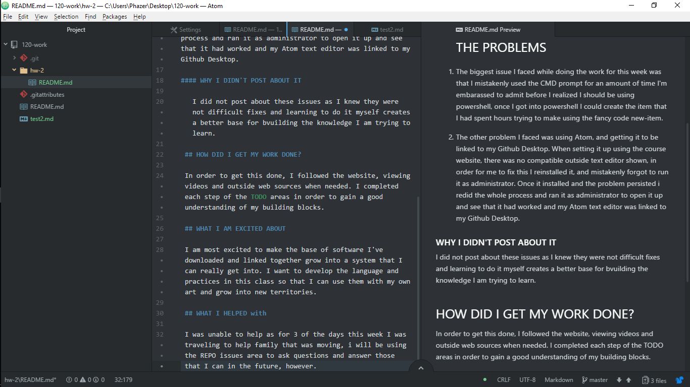

Maxwell Briggs

# THIS WEEK IN CODE

This week I finished setting up and getting comfortable with my coding softwares. These include but are not limited to;

 - Github
 - Github Desktop
 - Atom
 - Powershell

 

 ## THE PROBLEMS

1.  The biggest issue I faced while doing the work for this week was that I mistakenly used the CMD prompt for an amount of time I'm embarassed to admit before I realized I should be using powershell, once I got into powershell I could create the item that I had spent hours trying to make using the fancy code new-item.

2. The other problem I faced was using Atom, and getting it to be linked to my Github Desktop. When setting it up using the course website, there was no compatible outside text editor shown, in order for me to fix this I reinstalled it, and mistakenly forgot to run it as administrator. Once it installed and the problem persisted i redid the whole process and ran it as administrator to open it up and see that it had worked and my Atom text editor was linked to my Github Desktop.

#### WHY I DIDN'T POST ABOUT IT

   I did not post about these issues as I knew they were not difficult fixes and learning to do it myself creates a better base for bvuilding the knowledge I am trying to learn.

 ## HOW DID I GET MY WORK DONE?

 In order to get this done, I followed the website, viewing videos and outside web sources when needed. I completed each step of the TODO areas in order to gain a good understanding of my building blocks.

 ## WHAT I AM EXCITED ABOUT

 I am most excited to make the base of software I've downloaded and linked together grow into a system that I can really get into. I want to develop the language and practices in this class so that I can use them with my own art and grow into new territories.

 ## WHAT I HELPED with

 I was unable to help as for 3 of the days this week I was traveling to help family that was moving, i will be using the REPO issues area to ask questions and answer those that I can in the future, however.
